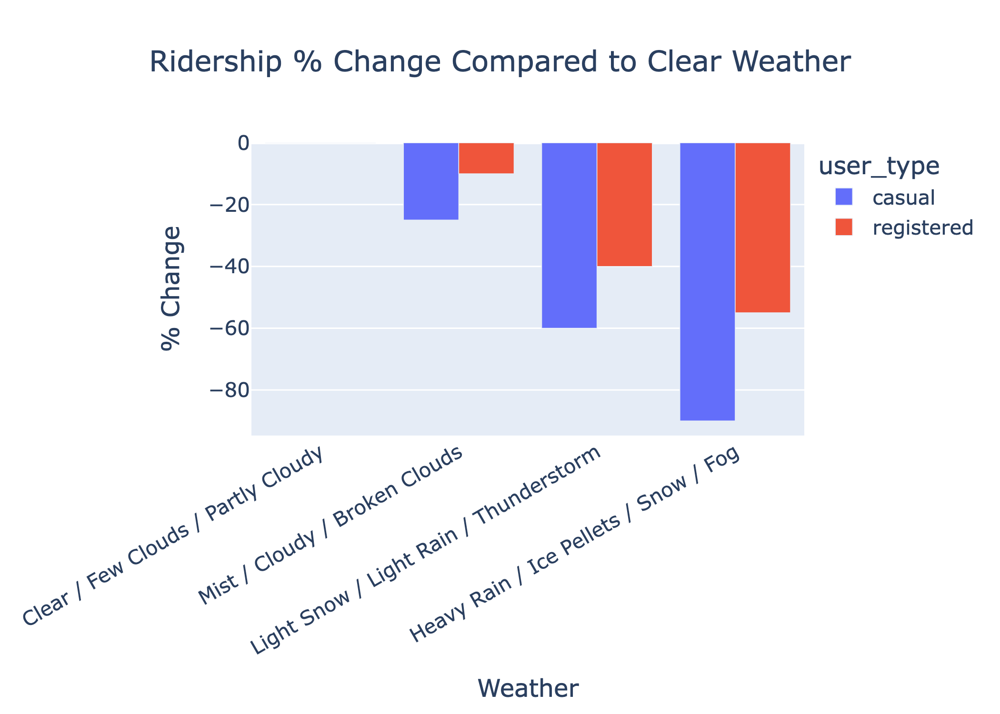
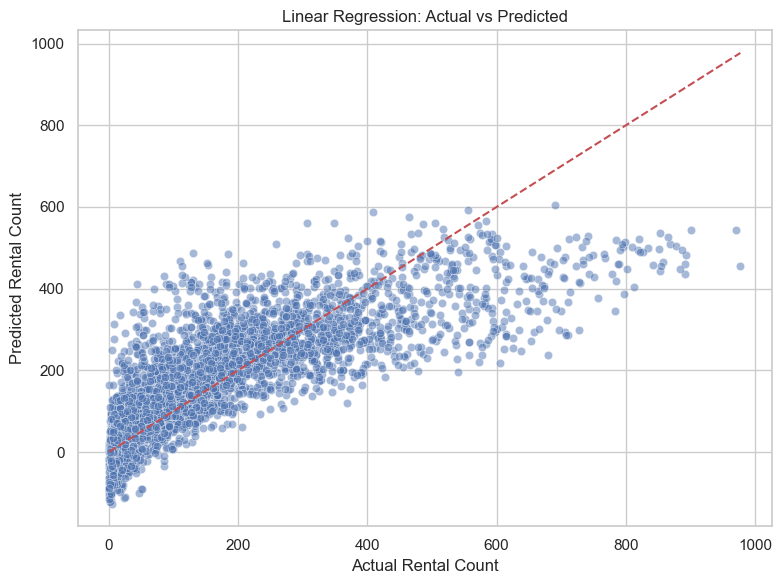
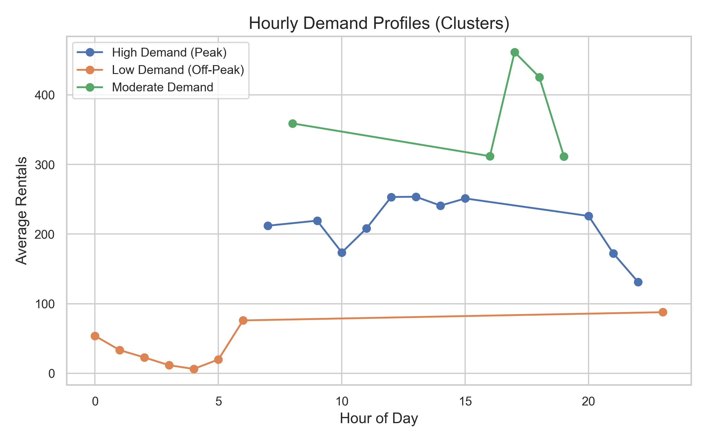
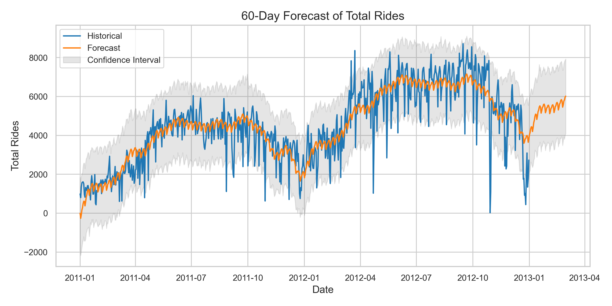
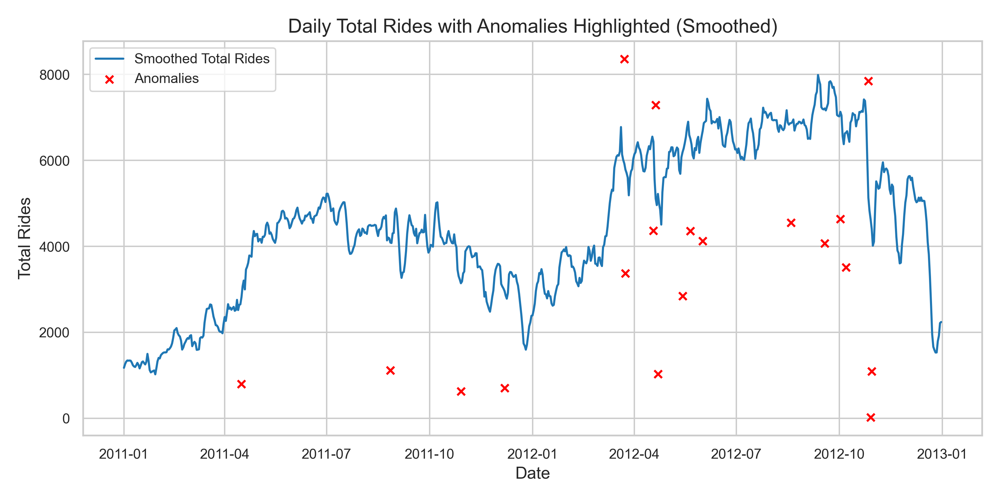
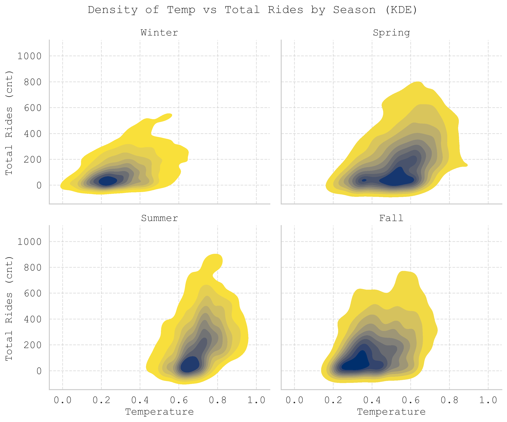

# DS_Team_1_Project
# Bike Sharing Demand Analysis & Forecasting  
_Data Science Institute – Cohort 6 – Team 1 Capstone Project_

As part of the University of Toronto’s Data Science Certificate program, our team analyzed the [Bike Sharing Dataset](https://archive.ics.uci.edu/dataset/275/bike+sharing+dataset) to deliver **actionable, data‑driven insights** for operational planning, marketing strategy, and urban policy.

** Key Takeaways:**
- **Predicted hourly and daily demand** using weather and calendar data.
- **Identified key drivers** (temperature, humidity, season, hour of day).
- **Clustered usage patterns** to distinguish peak vs. off‑peak behaviors.
- **Quantified weather impact** (e.g., heavy rain → −63% ridership).
- **Built forecasting models** (Linear Regression & Random Forest) with R² up to **0.84**.
- **Detected anomalies** for operational risk monitoring.

**Outcome:** A toolkit of insights for **higher management & stakeholders**—optimizing rebalancing schedules, marketing timing, and strategic planning.

## Members
- Rachel Barber-Pin [rbarberpin](https://github.com/rbarberpin)
- Ana Dubcovsky [anadub](https://github.com/anadub)
- Jonah Chevrier [chevrie4](https://github.com/chevrie4)
- Muhammad Ammar Bin Che Mahzan [AmmarMahzan](https://github.com/AmmarMahzan)
- Syyeda Kashfa Azim [skashfaazim](https://github.com/skashfaazim) 

## Business Case

Understanding **when** and **under what conditions** demand rises or falls allows:
- **Operations**: optimize truck routing, docking, and maintenance.
- **Marketing**: target low-demand windows and convert casual to registered riders.
- **City Planners**: plan infrastructure and safety initiatives during peak usage.

_This analysis focuses on the Capital Bikeshare system (Washington D.C., 2011–2012)._

## Research Questions

1. **Prediction Accuracy:** How accurately can we predict total rentals (`cnt`) per day and per hour using weather and calendar/time features? 
2. **Key Drivers:** Which variables (e.g., temperature, weather, hour-of-day, season) most influence demand?
3. **Rider Segment Patterns:** How do **casual vs. registered** riders differ in their daily and hourly usage patterns and what drives each group?
4. **Day-Type Patterns:** How do **working vs. non-working** days affect rental patterns at both daily and hourly resolutions, and what are the key drivers in each segment?  

We sourced our raw dataset by downloading from the link below: 
    - https://archive.ics.uci.edu/dataset/275/bike+sharing+dataset

## Stakeholders & Value

| Stakeholder         | Pain Point / Need                               | How Our Analysis Helps                                 |
|---------------------|-------------------------------------------------|--------------------------------------------------------|
| Operations/Logistics| Empty/full docks; inefficient truck routing     | Hourly/daily forecasts → proactive rebalancing         |
| Marketing/Growth    | When to promote; convert casual to registered   | Identify low-demand windows → targeted campaigns       |
| Finance/Execs       | Budget & ROI on bikes/docks                     | Demand forecasts → evidence-based investment           |
| City Planners/Public Health | Infrastructure & safety                 | Usage patterns → data-informed decisions               |

## Risks / Unknowns

- **Data leakage:** `casual`/`registered` predicting `cnt` inflates performance (excluded in LR).  
- **External events missing:** Concerts, policy changes, strikes not in dataset.  
- **Linear assumptions:** Linearity & constant variance may be violated.  
- **Temporal drift:** Patterns can change over years/locations.  
- **Aggregation:** System-wide counts hide station-level issues.

# Project overview  
  
    - Requirements
    - Exploratory Data Analysis
    - Understanding the Raw Data
    - Data Analysis on Pyton
        - Linear Regression
        - Clustering
    - Data Visualization
    - Conclusion
    - Team Videos

## Requirements

This project uses the following Python libraries:

- **Data Cleaning & Manipulation:** pandas, numpy
- **Exploratory Data Analysis (EDA):** pandas, seaborn, matplotlib, scipy
- **Feature Engineering & Preprocessing:** scikit-learn (OneHotEncoder, StandardScaler, train_test_split)
- **Modeling:** scikit-learn (LinearRegression, RandomForestRegressor), statsmodels
- **Clustering:** scikit-learn (KMeans)
- **Time Series Forecasting:** statsmodels (ARIMA, seasonal_decompose), Prophet
- **Anomaly Detection:** numpy, scipy (z-scores)
- **Interactive Visuals (Dynamic Plots):** plotly (plotly.express, plotly.graph_objects)

> To view dynamic plots, open the `.html` files in the `plots_dynamic/` folder in a web browser.  
> Example: [Open Interactive Feature Importances](plots_dynamic/feature_importances.html)

## Understanding the Raw Data
Bike-sharing rental process is highly correlated to the environmental and seasonal settings. For instance, weather conditions, precipitation, day of week, season, hour of the day, etc. can affect the rental behaviors. The core data set is related to the two-year historical log corresponding to years 2011 and 2012 from Capital Bikeshare system, Washington D.C., USA which is publicly available in http://capitalbikeshare.com/system-data.
The original raw data was aggregated on two hourly and daily basis and then extracted and added the corresponding weather and seasonal information. Weather information are extracted from http://www.freemeteo.com. 

### Schema 

| Column     | Type       | Description                                                                                                                                                 |
|------------|------------|-------------------------------------------------------------------------------------------------------------------------------------------------------------|
| instant    | Integer    | Record index                                                                                                                                                |
| dteday     | Date       | Date                                                                                                                                                        |
| season     | Categorical| 1: winter, 2: spring, 3: summer, 4: fall                                                                                                                     |
| yr         | Categorical| Year (0: 2011, 1: 2012)                                                                                                                                      |
| mnth       | Categorical| Month (1 to 12)                                                                                                                                              |
| hr         | Categorical| Hour (0 to 23)                                                                                                                                               |
| holiday    | Binary     | Whether the day is a holiday (from [DC holiday schedule](http://dchr.dc.gov/page/holiday-schedule))                                                        |
| weekday    | Categorical| Day of the week                                                                                                                                              |
| workingday | Binary     | 1 if the day is neither a weekend nor a holiday, 0 otherwise                                                                                                |
| weathersit | Categorical| 1: Clear, Few clouds, Partly cloudy, Partly cloudy                                                                                                           |
| temp       | Continuous | Normalized temperature in Celsius. Derived via (t - t_min)/(t_max - t_min), t_min = -8, t_max = +39 (only in hourly scale)                                 |
| atemp      | Continuous | Normalized feeling temperature in Celsius. Derived via (t - t_min)/(t_max - t_min), t_min = -16, t_max = +50 (only in hourly scale)                        |
| hum        | Continuous | Normalized humidity. Values are divided by 100 (max)                                                                                                        |
| windspeed  | Continuous | Normalized wind speed. Values are divided by 67 (max)                                                                                                       |
| casual     | Integer    | Count of casual users                                                                                                                                       |
| registered | Integer    | Count of registered users                                                                                                                                   |
| cnt        | Integer    | Count of total rental bikes including both casual and registered                                                                                            |

### Summarizations Found in the Dataset

The following table present key summarizations derived from the Bike Sharing dataset. These summarizations provide a foundational understanding of the dataset's scope, including the number of bikers (registered vs. casual), the time span covered, and the completeness of the data. 

| Question                                   | Analysis                                                  |
|--------------------------------------------|------------------------------------------------------------|
| How many years are in this data set?       | There are two years in this dataset                        |
| What is the time range of this dataset?    | The timeline range for this data is between 2011-01-01 to 2012-12-31 |
| What is the total number of instances in the dataset? | 17379                                          |
| What is the total number of columns?       | 13                                                         |
| How many values are missing?               | There are no missing values                                |

## Exploratory Data Analysis (EDA)

To understand the dataset before modeling, we performed a comprehensive EDA, creating visualizations such as heatmaps, scatter plots, bar graphs, and histograms, which were then reviewed by the team members to investigate trends and relationships in the dataset.

Our aim was to uncover temporal patterns, seasonality, weather impacts, and relationships among variables that drive bike rental behavior.

### Correlation Analysis

We began with correlations between numeric features (e.g., temperature, humidity, rentals) to detect multicollinearity and guide model inputs.

**Key insight:**
- Temperature (`temp` / `atemp`) has a strong positive correlation with rentals.
- Humidity shows a negative correlation.
- Wind speed has minimal influence.

Next we evaluated the amount of rides given a certain type of weather in a certain season.

###  Weather Sensitivity
Weather impacts are significant:
- Severe weather conditions (e.g. Heavy Rain/Snow and Light Snow/Rain) negatively impacts ridership.
---

### Hourly & Seasonal Patterns by User Type
To identify when people ride most:
- Registered riders dominate weekday commuting hours (8 AM and 5–6 PM).
- Casual usage spikes midday on weekends/holidays.
- Average ridership peaks in summer and drops sharply in winter.

We segmented hourly demand by user type and day type (weekday = dotted, weekend/holiday = solid) to understand behavioral differences.

**Key insight:**  
- Registered riders show sharp commuter peaks.
- Casual riders show smoother midday usage, particularly on weekends/holidays.
- Registered and casual riders show similar hourly usage patterns on weekends/holidays.
---

### Summary of EDA Insights
We reviewed all exploratory visualizations as a team to elucidate the following findings:
- **Temporal:** Registered riders show commuter-hour peaks and summer highs are seen across both registered and casual riders.
- **User Segments:** Registered riders account for >80% of total ridership and dominate weekdays.
- **Weather:** Clear negative effects of adverse weather.
- **Guidance for Modeling:** Include hour-of-day, season, and weather variables in predictive models.

These insights directly informed feature engineering and guided our modeling choices.

- 

To explore the dynamic features download the (INSERT FILE NAME) file in our repo. 

## Data Analysis (Linear Regression, Random Forest, Clustering, Forecasting & Anomaly Detection)

## Model Selection

### A. Linear Regression Results: Combined vs. Separate Daily & Hourly Models

### B. Random Forest Regressor

- **Captures Nonlinear Relationships and Interactions:**  
  Real-world factors often interact in complex ways. Random forests model these nonlinear patterns without manual feature engineering.

- **Improved Accuracy and Robustness:**  
  Ensemble learning reduces overfitting, generally improving prediction quality over linear models.

- **Feature Importance:**  
  Identifies the most influential features driving bike rentals, aiding further analysis.

### Summary

Using both models provides a balance between interpretability and predictive performance:

- The **linear regression model** helps explain *how* different factors influence ridership.
- The **random forest model** captures complex patterns for more accurate predictions.

This dual approach supports both exploratory analysis and practical forecasting needs.

# Summary of Insights from the Models

## 1. Linear Regression with One-Hot Encoding (Combined Day and Hour)

### What We Did:
- Transformed categorical variables (`season`, `hr`, `workingday`) using one-hot encoding.
- Trained a Linear Regression model on numeric + encoded features.

### What It Tells Us:
- Linearly additive effects: Assumes each feature independently affects bike rentals in a linear way.
- Strong predictors:  
  - Higher temperatures lead to more rentals.  
  - Higher humidity leads to fewer rentals.
- Hourly pattern:  
  Rentals peak during morning and evening commute hours on weekdays.
- Working day effect:  
  Slightly higher rental counts on working days compared to weekends for registered users.
- Limitations:  
  Cannot capture nonlinear trends or interactions (e.g., "hour × weekend").

### Linear Regression Results (Daily & Hourly)
### 1. Objective  
Predict total rentals (`cnt`) using weather and calendar/time features, then translate insights into operational recommendations.

### 2. Data & Method  
- **Datasets:** `day.csv`, `hour.csv`  
- **Target:** `cnt`  
- **Dropped cols:** `instant`, `dteday`, `casual`, `registered`, `cnt`  
- **Pipeline:** One-hot encode categorical + scale numeric → LinearRegression  
- **Split:** 80% train / 20% test  

### 3. Performance  

| Model  | R²    | RMSE  | MAE   |
| ------ | ----- | ----- | ----- |
| Daily  | 0.842 | 796.5 | 583.0 |
| Hourly | 0.681 | 100.4 |  74.1 |

### 4. Key Drivers

#### Daily Model  
- **− Weather (weathersit_3):** −1,048 rentals  
- **+ Year (yr_1):** +991 rentals  
- **− Winter vs + Fall:** −856 vs +798  
- **+ Clear weather (weathersit_1):** +778  
- **+ Temperature:** +686 per 1 SD  
- **Month effects:** Sep +639; Jul −484  
- **+ Sunday:** +286  

#### Hourly Model  
- **+ Hr 17 (5 PM):** +257; Hr 18 +217; Hr 8 +191  
- **− Hr 0–6:** −125 to −165 (overnight)  
- **− Worst weather (weathersit_4):** −77  

**Takeaways:** Bad weather & winter cut demand; warmth, fall & clear days boost it. Commute-hour spikes drive hourly patterns.

### 5. Residual Diagnostics  
- **Daily:** residuals centered around zero; mild non-linearity at extremes  
- **Hourly:** residual variance ↑ with fitted values (heteroscedasticity)

### 6. Segment Analyses

#### 6.1 Casual vs Registered  
- **Daily R²:** Reg 0.846 vs Cas 0.707  
- **Hourly R²:** Reg 0.676 vs Cas 0.585  
- **Patterns:** Reg riders peak commuter hours; casual riders flatter late-day/weekends  
- **Top Drivers (Daily):**  
  - **Casual:** Temp +336; Sunday +270; Fall +210; Working day −297  
  - **Registered:** Weather_3 −851; Yr_1 +851; Fall +817; Winter −772  
- **Top Drivers (Hourly):**  
  - **Casual:** Hr 17 +32; Hr 13–16 +29–31  
  - **Registered:** Hr 17 +225; Hr 8 +199; Hr 18 +197; Overnight (2–4 AM) −135  

#### 6.2 Working vs Non-Working  
- **Daily R²:** Work 0.822 vs Non 0.811  
- **Hourly R²:** Work 0.838 vs Non 0.778  
- **Patterns:** Workdays—sharp 8 AM/5 PM peaks; Non-Workdays—broad midday & Sunday surge  
- **Top Drivers (Daily):**  
  - **Working:** Feels-like temp +1,061; Yr ±1,037; Weather_3 −995  
  - **Non-Working:** Sunday +1,275; Dec −1,615; Weather_3 −1,516  
- **Top Drivers (Hourly):**  
  - **Working:** Hr 17 +317; Hr 8 +301; Hr 18 +289; Overnight (3–4 AM) −172 to −178  
  - **Non-Working:** Hr 12–15 +166–167; Hr 4 −151  

---

## Recommendations
1. **Rebalancing:** target commute peaks; schedule maintenance overnight.  
2. **Weather-aware ops:** adjust staffing/routes on bad-weather days; promote riding on clear days.  
3. **Seasonal campaigns:** launch before spring/fall spikes.  
4. **Segmentation:** model casual vs registered separately for tailored strategies.  

---

## Appendix  
See on "development" branch: `notebooks/linear_models.ipynb` for full code and workflow outline.  
### B. Linear Regression: Actual vs Predicted Visualization

#### Overview

This scatter plot visualizes the performance of a linear regression model by comparing the actual bike rental counts (y_test) with the model’s predicted values (y_pred). Each point represents one prediction, while the red dashed diagonal indicates perfect predictions where actual equals predicted.

#### Insights:

The model shows a generally strong upward trend, indicating that it has learned meaningful patterns from the data. 

However, there is visible underprediction at higher rental counts, as many points fall below the diagonal line. This suggests that the model struggles to fully capture peak demand, likely due to its linear nature. 

While the R² score of 0.6162 reflects moderate predictive power, the spread in higher-value predictions indicates room for improvement — particularly by exploring nonlinear models or engineering more informative features.

--- 

## C. Random Forest Regressor

### What We Did:
- Used the same one-hot encoded features.
- Trained a Random Forest model, which can automatically handle nonlinearities and feature interactions.

### What It Tells Us:
- Better predictive accuracy:  
  Higher R² score than the Linear Regression model.
- Captured nonlinear relationships and interactions:  
  For example, how hour effects vary depending on whether it is a working day.
- Important features:  
  - Hour of day (`hr_xx`) is the strongest predictor of rental volume.  
  - Temperature (`temp`) encourages more rentals when warmer.  
  - `workingday` and `season` explain weekly and seasonal patterns.
- Richer insights:  
  - Peak usage during weekday rush hours (registered users).  
  - Midday spikes on weekends (casual users).  
  - Sharp drops in rentals during cold or humid conditions.

### Random Forest: Actual vs Predicted Visualization

 

#### Overview

This scatter plot compares the actual bike rental counts (y_test) with the predicted counts from a Random Forest regression model (y_pred). Each green point represents a single prediction, and the red dashed diagonal line represents perfect predictions where actual and predicted counts are equal.

#### Insights:

The plot shows a strong alignment along the diagonal, indicating that the Random Forest model captures the underlying data patterns more effectively than a linear model. 

Predictions are more accurate across both low and high rental counts, with less systematic underprediction at peak values. 

Although some variance and scatter remain, particularly at higher rental counts, the model demonstrates improved predictive power and robustness, making it better suited to modeling the complex, nonlinear relationships in bike rental demand.

## Overall Insights
Both models provide valuable insights:

- The Linear Regression model helps us understand general trends and directional influences (e.g., temperature increase leads to more rentals).
- The Random Forest model offers a more accurate and nuanced understanding of bike rental behavior, capturing complex interactions between time, weather, and work schedules.

## 3. Hourly Demand Clustering (K‑Means)

### What We Did
- To go beyond overall averages, we analyzed hourly rental patterns to uncover hidden groupings in rider behavior.
- Calculated the mean rentals per hour across the dataset.
- Applied K‑Means clustering (k=3) on these hourly averages:
- Each hour of the day was assigned to a cluster based on similarity in demand levels.
- Post‑analysis, we labeled the clusters for interpretability:
  - **Cluster 0 – Low Demand:** overnight/early morning hours (0–5 AM)
  - **Cluster 1 – Moderate Demand:** steady midday usage
  - **Cluster 2 – High Demand:** morning and evening rush hour peaks

### Why Clustering?
- Traditional descriptive stats only show averages.  
  Clustering groups similar hours together, giving us actionable time segments rather than treating all hours individually.
- Helps operations and marketing teams segment demand windows instead of reacting hour by hour.

### What It Tells Us
- Clear, data‑driven segmentation of hours by demand intensity.
- Visualizes **peak**, **moderate**, and **off‑peak** periods for targeted decisions.

### Hourly Demand Profiles (Clusters)

#### Overview
The three profiles are distinct:
- **High Demand (Cluster 2):** prominent spikes at 8 AM and 5–6 PM, aligning with commuter behavior.
- **Moderate Demand (Cluster 1):** consistent rentals from late morning through afternoon.
- **Low Demand (Cluster 0):** minimal activity overnight and before 6 AM.

#### Insights
- **Operations:** focus bike redistribution and maintenance crews on high‑demand clusters, and scale down during low‑demand hours.
- **Marketing:** design promotions to stimulate off‑peak clusters or maximize engagement during moderate hours.

## 4. Time‑Series Forecasting (Prophet)

### What We Did
- To extend insights beyond historical data, we used **Prophet**, a time‑series forecasting library built for business data.
- Prepared input:
  - Converted the `dteday` column into Prophet’s `ds` (date) format.
  - Total daily rentals (`cnt`) as `y` (target).
- Configured Prophet with:
  - **Yearly and weekly seasonality** to capture recurring patterns.
  - **Additive seasonality mode** for interpretability.
- Generated a **60‑day forecast** with upper and lower 95% confidence intervals.

### Why Prophet?
- Handles missing data and outliers gracefully.
- Captures seasonality (e.g., summer peaks, winter dips) and trend changes.
- Produces interpretable components for stakeholders.

### What It Tells Us
- Predicted rental demand for each day in the next two months.
- Highlights seasonal fluctuations:
  - **Higher demand** in warmer months.
  - **Lower demand** in colder months.
- Provides clear confidence intervals to plan for uncertainty.

### Forecast Visualization

#### Insights
- **Operations:** schedule maintenance and rebalance crews during forecasted low‑demand days.
- **Marketing:** plan campaigns in advance, targeting forecasted dips to boost ridership.
- **Management:** proactively allocate resources instead of reacting to real‑time surges or shortages.

## 5. Anomaly Detection

### What We Did
- Applied a **7‑day rolling average** to smooth daily rental counts.
- Calculated **residuals** (actual rentals minus smoothed rentals).
- Used a **z‑score threshold (±2.5 standard deviations)** to flag anomalies:
  - **Positive anomalies:** days with unusually high rentals.
  - **Negative anomalies:** days with unusually low rentals.

### Why Anomaly Detection?
- Detects operational issues or external shocks early:
  - System outages, data recording errors, or unexpected weather events.
- Ensures data integrity for modeling and forecasting.
- Provides actionable intelligence to investigate specific days.

### What It Tells Us
- Highlights specific dates where ridership patterns deviated from expectations.
- Supports root‑cause analysis:
  - Did a promotion or event cause a spike?
  - Did bad weather or technical issues cause a drop?

### Anomaly Visualization

#### Insights
- **Operations:** investigate dips to ensure service reliability.
- **Marketing:** study spikes to replicate success from events or promotions.
- **Strategic Planning:** refine forecasts by understanding anomalies in historical patterns.

## Visualizations

A correlation matrix is a simple table that shows how strongly related different things are to each other.
Imagine you’re looking at things like temperature, bike rentals, wind speed, and humidity. A correlation matrix helps you see if, for example:
When temperature goes up, do bike rentals also go up?

Each cell in the matrix has a number between -1 and 1:
•	1 means a perfect positive relationship (both go up together).
•	-1 means a perfect negative relationship (one goes up, the other goes down).
•	0 means no relationship.

The matrix is often color-coded, so you can quickly spot strong or weak relationships without reading every number.
It’s a helpful way to find patterns in data and understand which factors might be influencing each other.

It is important to note:
Correlation ≠ Causation: A strong correlation doesn't mean one variable causes the other.
Outliers and non-linear relationships might distort correlation values.
Multicollinearity: If two variables are too highly correlated (like temp and atemp), we may want to drop one in modeling.

KDE plots for temperature vs total rides by season, similar to the scatter plots, but using KDE to visualize the density of points.
Lighter areas for low-density regions are easier to ignore, dark high-density areas grab attention.
Keep in mind that we are looking at total count. If we were to compare preferences given certain temperature and season, we should look at percentages.

This graph highlights the different behaviors of registered and casual riders, not only between the two user types but also depending on whether it is a working day or not.
Registered riders display two distinct peaks: one around 8 a.m. and another around 5:30 p.m. on working days. In contrast, the other user types and day combinations do not show such abrupt peaks, with usage generally concentrated between 7 a.m. and 9 p.m.

Average Ridership by Hour (Working Day = 1, Non-Working Day = 0)

Average Ridership by Hour (Working Day = 1, Non-Working Day = 0)

The following graph illustrates the impact of varying weather conditions on ridership patterns, with severe weather events resulting in significant deviations from typical usage trends.

## Predictive Modeling Insights – Overview

To translate our exploratory analysis into forward‑looking strategy, we built and evaluated multiple models:

- **Linear Regression** (see section above): a simple, interpretable baseline.
- **Random Forest Regressor**: captures non‑linear patterns and complex interactions.
- **K‑Means Clustering**: segments hourly usage into high, medium, and low‑demand periods.
- **Time‑Series Forecasting (Prophet)**: projects future demand with confidence intervals.
- **Anomaly Detection**: flags unexpected spikes or dips for deeper investigation.

Each method complements the others: regression models explain drivers, clustering uncovers operational patterns, forecasting guides resource planning, and anomaly detection highlights risks and opportunities.

For detailed visuals and interpretation, see individual sections:
- [Linear Regression](#1-linear-regression-with-one-hot-encoding)
- [Random Forest](#2-random-forest-regressor)
- [Clustering](#3-hourly-demand-clustering)
- [Forecasting](#4-time-series-forecasting-prophet)
- [Anomaly Detection](#5-anomaly-detection)

## Conclusion
Through this capstone project, our team combined **exploratory analysis**, **predictive modeling**, and **advanced visualization techniques** to transform a raw operational dataset into a rich source of actionable insights.

 **What we accomplished together:**
- Mapped **hourly and seasonal usage patterns**, revealing when and where demand peaks.
- Quantified the impact of **weather and temporal variables** on ridership, giving clarity on controllable and uncontrollable drivers.
- Built interpretable **Linear Regression models** as a strong baseline and contrasted them with **Random Forest Regressors** for improved accuracy and richer feature interactions.

 **Why this matters to our stakeholders:**
- **Operations teams** can now proactively adjust fleet distribution and maintenance schedules around predicted demand patterns, instead of reacting after issues occur.
- **Marketing and growth teams** can align campaigns with low‑demand windows or amplify peak opportunities, to incentivize casual riders to register.
- **Executives and finance** gain data‑backed confidence in ROI decisions on infrastructure and budget allocations.
- **City planners and public health** can leverage our findings to inform urban mobility and safety initiatives, knowing when bikes are most utilized.

 **Key Takeaways:**
- Weather and seasonality significantly drive usage patterns—summer and clear days are your allies.
- Demand is far from uniform: **commuting peaks** and **weekend midday surges** stand out and should guide rebalancing and staffing.
- Predictive modeling doesn’t just describe the past; it gives the power to **anticipate the future** and prepare for uncertainty.

**Team effort & next steps:**
This was a collaborative journey where each member brought unique skills—data wrangling, visualization design, statistical modeling, and time‑series expertise—to craft a comprehensive data story.

Looking ahead, these insights can be extended by:
- Integrating **real‑time data** streams to refresh forecasts.
- Refining models with **additional external factors** (events, holidays, weather alerts).
- Scaling insights to **station‑level granularity** for even sharper operational decisions.

**In short:**  
We’ve built more than just plots and models — we’ve built a decision‑support foundation that can help a bike‑sharing system operate smarter, market smarter, and grow sustainably. 
