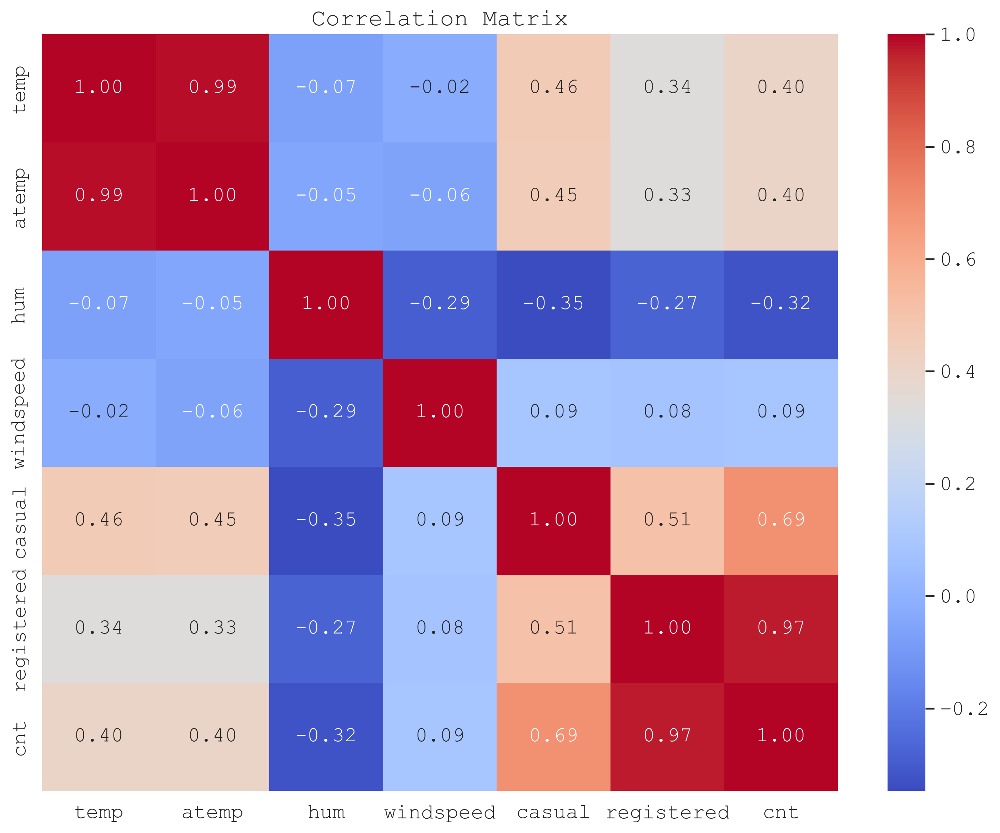
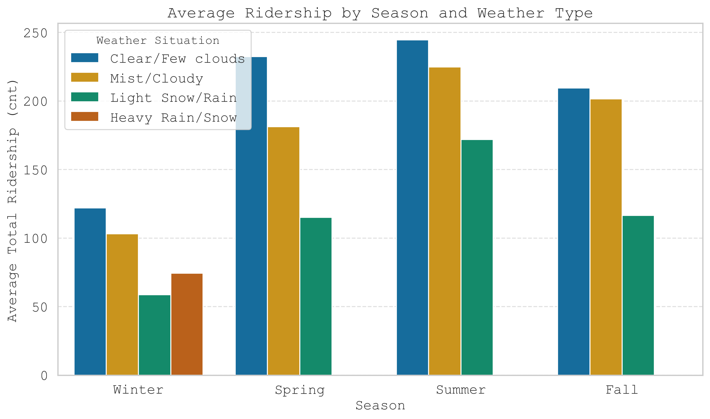
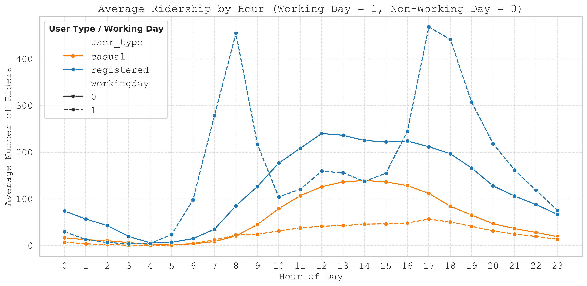
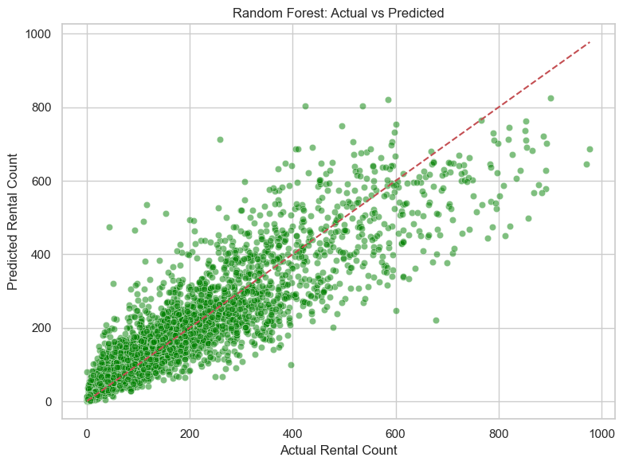

# DS_Team_1_Project
# Bike Sharing Demand Analysis & Forecasting  
_Data Science Institute – Cohort 6 – Team 1 Capstone Project_

As part of the University of Toronto’s Data Science Certificate program, our team analyzed the [Bike Sharing Dataset](https://archive.ics.uci.edu/dataset/275/bike+sharing+dataset) to deliver **actionable, data‑driven insights** for operational planning, marketing strategy, and urban policy.

**Key Takeaways:**
- **Predicted hourly and daily demand** using weather and calendar data.
- **Identified key drivers** (temperature, humidity, season, hour of day).
- **Clustered usage patterns** to distinguish peak vs. off‑peak behaviors.
- **Quantified weather impact** (e.g., heavy rain → −63% ridership).
- **Built forecasting models** (Linear Regression & Random Forest) with R² up to **0.84**.
- **Detected anomalies** for operational risk monitoring.

**Outcome:** A toolkit of insights for **higher management & stakeholders**—optimizing rebalancing schedules, marketing timing, and strategic planning.

## Members
- Rachel Barber-Pin [rbarberpin](https://github.com/rbarberpin)
- Ana Dubcovsky [anadub](https://github.com/anadub)
- Jonah Chevrier [chevrie4](https://github.com/chevrie4)
- Muhammad Ammar Bin Che Mahzan [AmmarMahzan](https://github.com/AmmarMahzan)
- Syyeda Kashfa Azim [skashfaazim](https://github.com/skashfaazim) 

## Business Case

Understanding **when** and **under what conditions** demand rises or falls allows:
- **Operations**: optimize truck routing, docking, and maintenance.
- **Marketing**: target low-demand windows and convert casual to registered riders.
- **City Planners**: plan infrastructure and safety initiatives during peak usage.

_This analysis focuses on the Capital Bikeshare system (Washington D.C., 2011–2012)._

## Research Questions

1. **Prediction Accuracy:** How accurately can we predict total rentals (`cnt`) per day and per hour using weather and calendar/time features? 
2. **Key Drivers:** Which variables (e.g., temperature, weather, hour-of-day, season, type of day) most influence demand?
3. **Rider Segment Patterns:** How do **casual vs. registered** riders differ in their daily and hourly usage patterns and what drives each group?

We sourced our raw dataset by downloading from the link below: 
    - https://archive.ics.uci.edu/dataset/275/bike+sharing+dataset

## Stakeholders & Value

| Stakeholder         | Pain Point / Need                               | How Our Analysis Helps                                 |
|---------------------|-------------------------------------------------|--------------------------------------------------------|
| Operations/Logistics| Empty/full docks; inefficient truck routing     | Hourly/daily forecasts → proactive rebalancing         |
| Marketing/Growth    | When to promote; convert casual to registered   | Identify low-demand windows → targeted campaigns       |
| Finance/Executives       | Budget & ROI on bikes/docks                     | Demand forecasts → evidence-based investment           |
| City Planners/Public Health | Infrastructure & safety                 | Usage patterns → data-informed decisions               |

## Risks / Unknowns

- **Data leakage:** `casual`/`registered` predicting `cnt` inflates performance (excluded in LR).  
- **External events missing:** Concerts, policy changes, strikes, extreme weather dates not in dataset.  
- **Linear assumptions:** Linearity & constant variance may be violated, unable to assess due to timeline restraints. 
- **Temporal drift:** Patterns can change over years/locations.  
- **Aggregation:** System-wide counts hide station-level issues or how individual usage data is counted.
- **Technological change:** Due to technological evolution, data collection from 10+ years ago may be outdated

# Project overview  
  
    - Requirements
    - Understanding the Raw Data
    - Exploratory Data Analysis
    - Data Analysis
        - Linear Regression Model
        - Random Forest Model
    - Conclusion
    - Appendix
    - Team Videos

## Requirements

This project uses the following Python libraries:

- **Data Cleaning & Manipulation:** pandas, numpy
- **Exploratory Data Analysis (EDA):** pandas, seaborn, matplotlib, scipy
- **Feature Engineering & Preprocessing:** scikit-learn (OneHotEncoder, StandardScaler, train_test_split)
- **Modeling:** scikit-learn (LinearRegression, RandomForestRegressor), statsmodels

## Understanding the Raw Data
Bike-sharing rental process is correlated to the environmental and seasonal settings. For instance, weather conditions, precipitation, day of week, season, hour of the day, etc. can affect the rental behaviors. The core data set is related to the two-year historical log corresponding to years 2011 and 2012 from Capital Bikeshare system, Washington D.C., USA.

The original raw data was aggregated on two basis (hourly and daily) and then extracted and added the corresponding weather and seasonal information. Weather information are extracted from http://www.freemeteo.com. 

### Schema 

| Column     | Type       | Description                                                                                                                                                 |
|------------|------------|-------------------------------------------------------------------------------------------------------------------------------------------------------------|
| instant    | Integer    | Record index                                                                                                                                                |
| dteday     | Date       | Date                                                                                                                                                        |
| season     | Categorical| 1: winter, 2: spring, 3: summer, 4: fall                                                                                                                     |
| yr         | Categorical| Year (0: 2011, 1: 2012)                                                                                                                                      |
| mnth       | Categorical| Month (1 to 12)                                                                                                                                              |
| hr         | Categorical| Hour (0 to 23)                                                                                                                                               |
| holiday    | Binary     | Whether the day is a holiday (from [DC holiday schedule](http://dchr.dc.gov/page/holiday-schedule))                                                        |
| weekday    | Categorical| Day of the week                                                                                                                                              |
| workingday | Binary     | 1 if the day is neither a weekend nor a holiday, 0 otherwise                                                                                                |
| weathersit | Categorical| 1: Clear, Few clouds, Partly cloudy, Partly cloudy                                                                                                           |
| temp       | Continuous | Normalized temperature in Celsius. Derived via (t - t_min)/(t_max - t_min), t_min = -8, t_max = +39 (only in hourly scale)                                 |
| atemp      | Continuous | Normalized feeling temperature in Celsius. Derived via (t - t_min)/(t_max - t_min), t_min = -16, t_max = +50 (only in hourly scale)                        |
| hum        | Continuous | Normalized humidity. Values are divided by 100 (max)                                                                                                        |
| windspeed  | Continuous | Normalized wind speed. Values are divided by 67 (max)                                                                                                       |
| casual     | Integer    | Count of casual users                                                                                                                                       |
| registered | Integer    | Count of registered users                                                                                                                                   |
| cnt        | Integer    | Count of total rental bikes including both casual and registered                                                                                            |

### Summarizations Found in the Dataset

The following table present key summarizations derived from the Bike Sharing dataset. These summarizations provide a foundational understanding of the dataset's scope, including the number of bikers (registered vs. casual), the time span covered, and the completeness of the data. 

| Question                                   | Analysis                                                  |
|--------------------------------------------|------------------------------------------------------------|
| How many years are in this data set?       | There are two years in this dataset                        |
| What is the time range of this dataset?    | The timeline range for this data is between 2011-01-01 to 2012-12-31 |
| What is the total number of instances in the dataset? | 17379                                          |
| What is the total number of columns?       | 13                                                         |
| How many values are missing or duplicated?               | There are no missing or duplicated values                                |

## Exploratory Data Analysis (EDA)

To understand the dataset before modeling, we performed a comprehensive EDA, creating visualizations such as heatmaps, scatter plots, bar graphs, and histograms, which were then reviewed by the team members to investigate trends and relationships in the dataset.

Our aim was to uncover temporal patterns, seasonality, weather impacts, and relationships among variables that drive bike rental behavior.

### Correlation Analysis

We began with correlations between numeric features (e.g., temperature, humidity, rentals) to detect multicollinearity and guide model inputs.

**Key insight:**
- Temperature (`temp` / `atemp`) has a strong positive correlation with rentals.
- Humidity shows a negative correlation.
- Wind speed has minimal influence.

Next we evaluated the amount of rides given a certain type of weather in a certain season.

###  Weather Sensitivity
Weather impacts are significant:
- Severe weather conditions (e.g. Heavy Rain/Snow and Light Snow/Rain) negatively impacts ridership.
---

### Hourly & Seasonal Patterns by User Type
To identify when people ride most:
- Registered riders dominate weekday commuting hours (8 AM and 5–6 PM).
- Casual usage spikes midday on weekends/holidays.
- Average ridership peaks in summer and drops sharply in winter.

We segmented hourly demand by user type and day type (weekday = dotted, weekend/holiday = solid) to understand behavioral differences.

**Key insight:**  
- Registered riders show sharp commuter peaks.
- Casual riders show smoother midday usage, particularly on weekends/holidays.
- Registered and casual riders show similar hourly usage patterns on weekends/holidays.
---

### Summary of EDA Insights
We reviewed all exploratory visualizations as a team to elucidate the following findings:
- **Temporal:** Registered riders show commuter-hour peaks and summer highs are seen across both registered and casual riders.
- **User Segments:** Registered riders account for >80% of total ridership and dominate weekdays.
- **Weather:** Clear negative effects of adverse weather.
- **Guidance for Modeling:** Include hour-of-day, season, and weather variables in predictive models.

These insights directly informed feature engineering and guided our modeling choices.

## Data Analysis (Linear Regression, Random Forest, Clustering, Forecasting & Anomaly Detection)

### Model Selection

### A. Linear Regression Results: Combined vs. Separate Daily Models

### B. Random Forest Regressor

- **Captures Nonlinear Relationships and Interactions:**  
  Real-world factors often interact in complex ways. Random forests model these nonlinear patterns without manual feature engineering.

- **Improved Accuracy and Robustness:**  
  Ensemble learning reduces overfitting, generally improving prediction quality over linear models.

- **Feature Importance:**  
  Identifies the most influential features driving bike rentals, aiding further analysis.

### Summary

Using both models provides a balance between interpretability and predictive performance:

- The **linear regression model** helps explain *how* different factors influence ridership.
- The **random forest model** captures complex patterns for more accurate predictions.

This dual approach supports both exploratory analysis and practical forecasting needs.

# Summary of Insights from the Models

## 1. Linear Regression with One-Hot Encoding (Combined Day and Hour)

### What We Did:
- Transformed categorical variables (`season`, `hr`, `workingday`) using one-hot encoding.
- Trained a Linear Regression model on numeric + encoded features.

### What It Tells Us:
- Linearly additive effects: Assumes each feature independently affects bike rentals in a linear way.
- Strong predictors:  
  - Higher temperatures lead to more rentals.  
  - Higher humidity leads to fewer rentals.
- Hourly pattern:  
  Rentals peak during morning and evening commute hours on weekdays.
- Working day effect:  
  Slightly higher rental counts on working days compared to weekends for registered users.
- Limitations:  
  Cannot capture nonlinear trends or interactions (e.g., "hour × weekend").

### Linear Regression Results (Daily & Hourly)
### 1. Objective  
Predict total rentals (`cnt`) using weather and calendar/time features, then translate insights into operational recommendations.

### 2. Data & Method  
- **Datasets:** `day.csv`, `hour.csv`  
- **Target:** `cnt`  
- **Dropped cols:** `instant`, `dteday`, `casual`, `registered`, `cnt`  
- **Pipeline:** One-hot encode categorical + scale numeric → LinearRegression  
- **Split:** 80% train / 20% test  

### 3. Performance  

| Model  | R²    | RMSE  | MAE   |
| ------ | ----- | ----- | ----- |
| Daily  | 0.842 | 796.5 | 583.0 |
| Hourly | 0.681 | 100.4 |  74.1 |

### 4. Key Drivers

#### Daily Model: Predicted vs Actual
- **Diagonal line**: Represent a prefect model (predicted = actual).  
- **Dots close to the line**: means the model is predicting well.  
- **Under-prediction**: points above the line (actual > predicted) - the model missed some of the demand spikes. 
- **Over-prediction**: points below the line (predicted > actual)—the model sometimes overshoots when demand is low.  
- **Overall pattern**: most points hug the line, giving us a strong R² of 0.842. A few outliers at the high end show where the model underestimates peak days.  

**Takeaways:**
- The Daily model shows a clear upward trends, and the predicted values rise as actual values rise, meaning that it is capturing the main patterns in the data. 

## Recommendations
1. **Rebalancing:** target commute peaks; schedule maintenance overnight.  
2. **Weather-aware ops:** adjust staffing/routes on bad-weather days; promote riding on clear days.  
3. **Seasonal campaigns:** launch before spring/fall spikes.  
4. **Segmentation:** model casual vs registered separately for tailored strategies.  

--- 

## C. Random Forest Regressor

### What We Did:
- Used the same one-hot encoded features.
- Trained a Random Forest model, which can automatically handle nonlinearities and feature interactions.

### What It Tells Us:
- Better predictive accuracy:  
- Captured nonlinear relationships and interactions:  
  For example, how hour effects vary depending on whether it is a working day.
- Important features:  
  - Hour of day (`hr_xx`) is the strongest predictor of rental volume.  
  - Temperature (`temp`) encourages more rentals when warmer.  
  - `workingday` and `season` explain weekly and seasonal patterns.
- Richer insights:  
  - Peak usage during weekday rush hours (registered users).  
  - Midday spikes on weekends (casual users).  
  - Sharp drops in rentals during cold or humid conditions.

### Random Forest: Actual vs Predicted Visualization

 

#### Overview

This scatter plot compares the actual bike rental counts (y_test) with the predicted counts from a Random Forest regression model (y_pred). Each green point represents a single prediction, and the red dashed diagonal line represents perfect predictions where actual and predicted counts are equal.

#### Insights:

The plot shows a strong alignment along the diagonal, indicating that the Random Forest model captures the underlying data patterns more effectively than a linear model. 

Predictions are more accurate across both low and high rental counts, with less systematic underprediction at peak values. 

Although some variance and scatter remain, particularly at higher rental counts, the model demonstrates improved predictive power and robustness, making it better suited to modeling the complex, nonlinear relationships in bike rental demand.

## Conclusion
Through this capstone project, our team combined **exploratory analysis**, **advanced visualization techniques**, and **predictive modeling** to transform a raw operational dataset into a rich source of actionable insights.

 **What we accomplished together:**
- Mapped **hourly and seasonal usage patterns**, revealing when and where demand peaks.
- Quantified the impact of **weather and temporal variables** on ridership, giving clarity on controllable and uncontrollable drivers.
- Built interpretable **Linear Regression models** as a strong baseline and contrasted them with **Random Forest Regressors** for improved accuracy and richer feature interactions.

 **Why this matters to our stakeholders:**
- **Operations teams** can now proactively adjust fleet distribution and maintenance schedules around predicted demand patterns, instead of reacting after issues occur.
- **Marketing and growth teams** can align campaigns with low‑demand windows or amplify peak opportunities, to incentivize casual riders to register.
- **Executives and finance** gain data‑backed confidence in ROI decisions on infrastructure and budget allocations.
- **City planners and public health** can leverage our findings to inform urban mobility and safety initiatives, knowing when bikes are most utilized.

 **Key Takeaways:**
- Weather and seasonality significantly drive usage patterns—summer and clear days are your allies.
- Demand is far from uniform: **commuting peaks** and **weekend midday surges** stand out and should guide rebalancing and staffing.
- Predictive modeling doesn’t just describe the past; it gives the power to **anticipate the future** and prepare for uncertainty.

**Team effort & next steps:**
This was a collaborative journey where each member brought unique skills—data wrangling, visualization design, statistical modeling, and time‑series expertise—to craft a comprehensive data story.

Looking ahead, these insights can be extended by:
- Integrating **real‑time data** streams to refresh forecasts.
- Refining models with **additional external factors** (events, holidays, weather alerts).
- Scaling insights to **station‑level granularity** for even sharper operational decisions.

**In short:**  
We’ve built more than just plots and models — we’ve built a decision‑support foundation that can help a bike‑sharing system operate smarter, market smarter, and grow sustainably. 

## Appendix  
See folders in the development branch for full code and workflow outline for extra exploratory analysis, visualizations and models that the team completed but were decided to be out of scope for adding to the readme. These extra resources provides more in-depth analysis for above mentioned stakeholders. 
