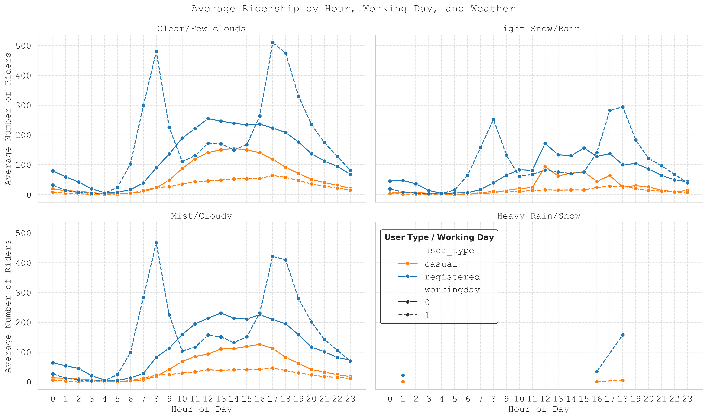

# DS_Team_1_Project

# Bike Sharing Dataset

Data Science Institute - Cohort 6 - Team 1 Project

As part of the Data Scince Certificate program at the University of Toronto's Data Science Institute, our capstone project allowed us to showcase our technical skills that we have developed over this certificate program . We chose the "Bike Sharing" dataset to apply our analytical and technical skills to. To complete our final project, we summarized the data, performed exploratory analysis', and created visualizations to present actionable insights. 

## Members

- Rachel Barber-Pin [rbarberpin](https://github.com/rbarberpin)
- Ana Dubcovsky [anadub](https://github.com/anadub)
- Jonah Chevrier [chevrie4](https://github.com/chevrie4)
- Muhammad Ammar Bin Che Mahzan [AmmarMahzan](https://github.com/AmmarMahzan)
- Syyeda Kashfa Azim [skashfaazim](https://github.com/skashfaazim) 

# Business case

We analyze the Bike Sharing dataset to **predict when and under what conditions demand rises or falls**. This lets:

- **Operations/Logistics** optimize bike/dock rebalancing and schedule maintenance in low-demand windows.  
- **Marketing/Growth** time promotions to slow periods and boost conversion from casual to registered riders.  
- **City planners/Public health** plan infrastructure and safety initiatives during peak use.

*Scope note:* Data are from Washington D.C. (2011–2012); patterns may not generalize to other cities or years.

## Research Questions

1. **Prediction Accuracy:** How accurately can we predict total rentals (`cnt`) per day and per hour using weather and calendar/time features? 
2. **Key Drivers:** Which variables (e.g., temperature, weather, hour-of-day, season) most influence demand? 

We sourced our raw dataset by downloading from the link below: 
    - https://archive.ics.uci.edu/dataset/275/bike+sharing+dataset

## Stakeholders & Value

| Stakeholder         | Pain Point / Need                               | How Our Analysis Helps                                |
|---------------------|--------------------------------------------------|--------------------------------------------------------|
| Operations/Logistics| Empty/full docks; inefficient truck routing     | Hourly/daily forecasts → smarter rebalancing schedules |
| Marketing/Growth    | When to promote; convert casual to registered   | Identify low-demand windows → targeted campaigns       |
| Finance/Execs       | Budget & ROI on bikes/docks                     | Demand forecasts → evidence-based allocation           |
| City Planners/Public Health | Plan infra & safety initiatives         | Usage patterns → data-informed decisions               |

## Risks / Unknowns

- **Data leakage:** `casual`/`registered` predicting `cnt` inflates performance (excluded in LR).  
- **External events missing:** Concerts, policy changes, strikes not in dataset.  
- **Linear assumptions:** Linearity & constant variance may be violated.  
- **Temporal drift:** Patterns can change over years/locations.  
- **Aggregation:** System-wide counts hide station-level issues.

# Project overview  
  
    - Requirements
    - Exploratory Data Analysis
    - Understanding the Raw Data
    - Data Analysis on Pyton
        - Linear Regression
        - Clustering
    - Data Visualization
    - Conclusion
    - Team Videos

## Requirements

This project uses the following Python libraries
    - Data cleaning: pandas, numpy
    - Data exploring: pandas, scikitlearn
    - Visualization: matplotlib, seaborn

## Understanding the Raw Data
Bike-sharing rental process is highly correlated to the environmental and seasonal settings. For instance, weather conditions, precipitation, day of week, season, hour of the day, etc. can affect the rental behaviors. The core data set is related to the two-year historical log corresponding to years 2011 and 2012 from Capital Bikeshare system, Washington D.C., USA which is publicly available in http://capitalbikeshare.com/system-data.
The original raw data was aggregated on two hourly and daily basis and then extracted and added the corresponding weather and seasonal information. Weather information are extracted from http://www.freemeteo.com. 

### Schema 

| Column     | Type       | Description                                                                                                                                                 |
|------------|------------|-------------------------------------------------------------------------------------------------------------------------------------------------------------|
| instant    | Integer    | Record index                                                                                                                                                |
| dteday     | Date       | Date                                                                                                                                                        |
| season     | Categorical| 1: winter, 2: spring, 3: summer, 4: fall                                                                                                                     |
| yr         | Categorical| Year (0: 2011, 1: 2012)                                                                                                                                      |
| mnth       | Categorical| Month (1 to 12)                                                                                                                                              |
| hr         | Categorical| Hour (0 to 23)                                                                                                                                               |
| holiday    | Binary     | Whether the day is a holiday (from [DC holiday schedule](http://dchr.dc.gov/page/holiday-schedule))                                                        |
| weekday    | Categorical| Day of the week                                                                                                                                              |
| workingday | Binary     | 1 if the day is neither a weekend nor a holiday, 0 otherwise                                                                                                |
| weathersit | Categorical| 1: Clear, Few clouds, Partly cloudy, Partly cloudy                                                                                                           |
| temp       | Continuous | Normalized temperature in Celsius. Derived via (t - t_min)/(t_max - t_min), t_min = -8, t_max = +39 (only in hourly scale)                                 |
| atemp      | Continuous | Normalized feeling temperature in Celsius. Derived via (t - t_min)/(t_max - t_min), t_min = -16, t_max = +50 (only in hourly scale)                        |
| hum        | Continuous | Normalized humidity. Values are divided by 100 (max)                                                                                                        |
| windspeed  | Continuous | Normalized wind speed. Values are divided by 67 (max)                                                                                                       |
| casual     | Integer    | Count of casual users                                                                                                                                       |
| registered | Integer    | Count of registered users                                                                                                                                   |
| cnt        | Integer    | Count of total rental bikes including both casual and registered                                                                                            |

### Summarizations Found in the Dataset

The following table present key summarizations derived from the Bike Sharing dataset. These summarizations provide a foundational understanding of the dataset's scope, including the number of bikers (registered vs. casual), the time span covered, and the completeness of the data. 

| Question                                   | Analysis                                                  |
|--------------------------------------------|------------------------------------------------------------|
| How many years are in this data set?       | There are two years in this dataset                        |
| What is the time range of this dataset?    | The timeline range for this data is between 2011-01-01 to 2012-12-31 |
| What is the total number of instances in the dataset? | 17379                                          |
| What is the total number of columns?       | 13                                                         |
| How many values are missing?               | There are no missing values                                |

## Exploratory Data Analysis

Pandas, numpy, matplotlib.pyplot, and seaborn libraries were used for exploratory data analysis visualizations, including heatmaps, scatter plots, bar graphs, and histograms, which were then reviewed by the team members to investigate trends and relationships in the dataset. In particular, we noticed that:
-Total count of riders was mostly represented by registered riders (accounting for >80%), as opposed to casual riders.
-Registered ridership peaked on weekdays during rush hour, while casual ridership peaked mid-afternoon on weekends.

To explore the dynamic features download the (INSERT FILE NAME) file in our repo. 

## Data Analysis (Linear Regression, Clustering)

## Model Selection

### Linear Regression (with One-Hot Encoding)

- **Why this model?** Simple, interpretable baseline. One-hot encoding lets us include categorical drivers (season, month, hour, weather) correctly.  
- **Preprocessing:** OneHotEncoder for categorical codes + StandardScaler for numeric (temp, atemp, hum, windspeed).  
- **Performance:**  
  | Model  | R²    | RMSE  | MAE  |
  |--------|-------|-------|------|
  | Daily  | 0.842 | 796.5 | 583.0 |
  | Hourly | 0.681 | 100.4 | 74.1 |

- **Key drivers (|coef|):**  
  - **Daily:** Bad weather ↓ (weathersit_3), winter ↓, temp ↑, fall ↑, Sep ↑, Sunday ↑  
  - **Hourly:** Peaks at 08:00 & 17–18; lows 0–6; worst weather ↓

- **Limitations:** Assumes linear, additive effects and constant variance; residuals show some heteroscedasticity → consider Ridge/Lasso or tree models next.

> Full details (diagnostics, plots, coefficients, recommendations) in `reports/linear_model_findings.md`.

### Random Forest Regressor

- **Captures Nonlinear Relationships and Interactions:**  
  Real-world factors often interact in complex ways. Random forests model these nonlinear patterns without manual feature engineering.

- **Improved Accuracy and Robustness:**  
  Ensemble learning reduces overfitting, generally improving prediction quality over linear models.

- **Feature Importance:**  
  Identifies the most influential features driving bike rentals, aiding further analysis.

### Summary

Using both models provides a balance between interpretability and predictive performance:

- The **linear regression model** helps explain *how* different factors influence ridership.
- The **random forest model** captures complex patterns for more accurate predictions.

This dual approach supports both exploratory analysis and practical forecasting needs.

# Summary of Insights from the Models

## 1. Linear Regression with One-Hot Encoding

### What We Did:
- Transformed categorical variables (`season`, `hr`, `workingday`) using one-hot encoding.
- Trained a Linear Regression model on numeric + encoded features.

### What It Tells Us:
- Linearly additive effects: Assumes each feature independently affects bike rentals in a linear way.
- Strong predictors:  
  - Higher temperatures lead to more rentals.  
  - Higher humidity leads to fewer rentals.
- Hourly pattern:  
  Rentals peak during morning and evening commute hours on weekdays.
- Working day effect:  
  Slightly higher rental counts on working days compared to weekends for registered users.
- Limitations:  
  Cannot capture nonlinear trends or interactions (e.g., "hour × weekend").

### Linear Regression: Actual vs Predicted Visualization

#### Overview

This scatter plot visualizes the performance of a linear regression model by comparing the actual bike rental counts (y_test) with the model’s predicted values (y_pred). Each point represents one prediction, while the red dashed diagonal indicates perfect predictions where actual equals predicted.

#### Insights:

The model shows a generally strong upward trend, indicating that it has learned meaningful patterns from the data. 

However, there is visible underprediction at higher rental counts, as many points fall below the diagonal line. This suggests that the model struggles to fully capture peak demand, likely due to its linear nature. 

While the R² score of 0.6162 reflects moderate predictive power, the spread in higher-value predictions indicates room for improvement — particularly by exploring nonlinear models or engineering more informative features.

--- 

## 2. Random Forest Regressor

### What We Did:
- Used the same one-hot encoded features.
- Trained a Random Forest model, which can automatically handle nonlinearities and feature interactions.

### What It Tells Us:
- Better predictive accuracy:  
  Higher R² score than the Linear Regression model.
- Captured nonlinear relationships and interactions:  
  For example, how hour effects vary depending on whether it is a working day.
- Important features:  
  - Hour of day (`hr_xx`) is the strongest predictor of rental volume.  
  - Temperature (`temp`) encourages more rentals when warmer.  
  - `workingday` and `season` explain weekly and seasonal patterns.
- Richer insights:  
  - Peak usage during weekday rush hours (registered users).  
  - Midday spikes on weekends (casual users).  
  - Sharp drops in rentals during cold or humid conditions.

### Random Forest: Actual vs Predicted Visualization

 

#### Overview

This scatter plot compares the actual bike rental counts (y_test) with the predicted counts from a Random Forest regression model (y_pred). Each green point represents a single prediction, and the red dashed diagonal line represents perfect predictions where actual and predicted counts are equal.

#### Insights:

The plot shows a strong alignment along the diagonal, indicating that the Random Forest model captures the underlying data patterns more effectively than a linear model. 

Predictions are more accurate across both low and high rental counts, with less systematic underprediction at peak values. 

Although some variance and scatter remain, particularly at higher rental counts, the model demonstrates improved predictive power and robustness, making it better suited to modeling the complex, nonlinear relationships in bike rental demand.

## Overall Insights
Both models provide valuable insights:

- The Linear Regression model helps us understand general trends and directional influences (e.g., temperature increase leads to more rentals).
- The Random Forest model offers a more accurate and nuanced understanding of bike rental behavior, capturing complex interactions between time, weather, and work schedules.

## Visualizations

A correlation matrix is a simple table that shows how strongly related different things are to each other.
Imagine you’re looking at things like temperature, bike rentals, wind speed, and humidity. A correlation matrix helps you see if, for example:
When temperature goes up, do bike rentals also go up?

Each cell in the matrix has a number between -1 and 1:
•	1 means a perfect positive relationship (both go up together).
•	-1 means a perfect negative relationship (one goes up, the other goes down).
•	0 means no relationship.

The matrix is often color-coded, so you can quickly spot strong or weak relationships without reading every number.
It’s a helpful way to find patterns in data and understand which factors might be influencing each other.

It is important to note:
Correlation ≠ Causation: A strong correlation doesn't mean one variable causes the other.
Outliers and non-linear relationships might distort correlation values.
Multicollinearity: If two variables are too highly correlated (like temp and atemp), we may want to drop one in modeling.

KDE plots for temperature vs total rides by season, similar to the scatter plots, but using KDE to visualize the density of points.
Lighter areas for low-density regions are easier to ignore, dark high-density areas grab attention.
Keep in mind that we are looking at total count. If we were to compare preferences given certain temperature and season, we should look at percentages.

Here we evaluate the amount of rides given a certain type of weather at a certain season.

This graph highlights the different behaviors of registered and casual riders, not only between the two user types but also depending on whether it is a working day or not.
Registered riders display two distinct peaks: one around 8 a.m. and another around 5:30 p.m. on working days. In contrast, the other user types and day combinations do not show such abrupt peaks, with usage generally concentrated between 7 a.m. and 9 p.m.

Average Ridership by Hour (Working Day = 1, Non-Working Day = 0)

Average Ridership by Hour (Working Day = 1, Non-Working Day = 0)

The following graph illustrates the impact of varying weather conditions on ridership patterns, with severe weather events resulting in significant deviations from typical usage trends.

## Conclusion
